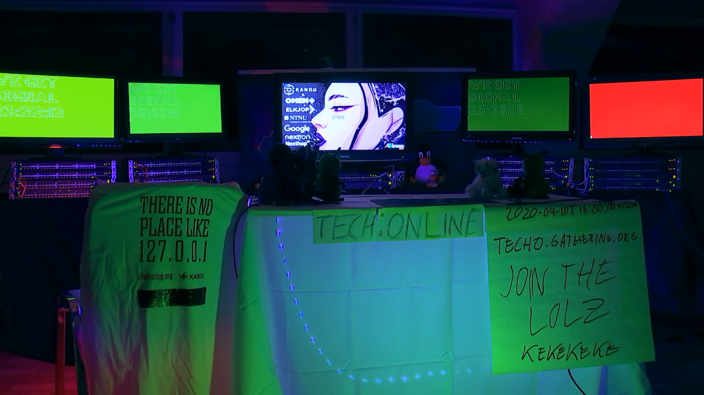
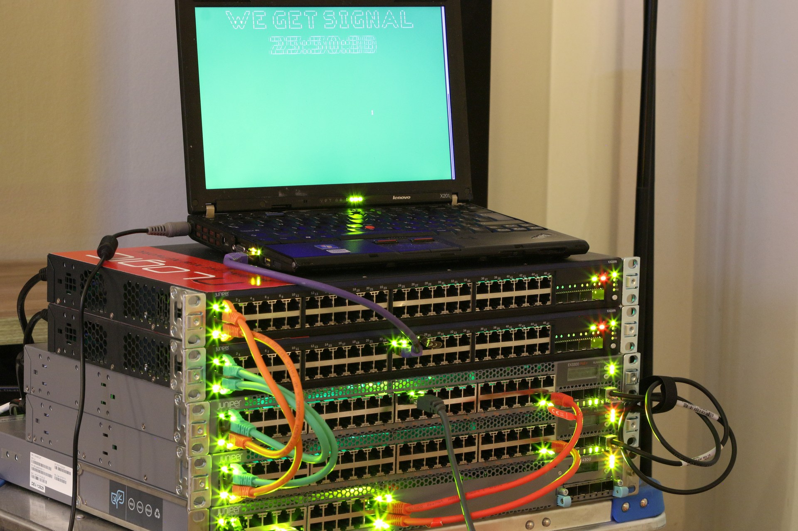

Tech:Online, behind the scenes
==============================

Hei

This is a pretty raw dump of most(!) of the bits and pieces that made up
Tech:Online. All of this was thrown together in a handful of weeks,
including POC, so it's _very_ rough around the edges.

Some explanations are needed.

What is Tech:Online?
....................

Tech:Online was a respone to The Gathering 2020 (gathering.org) being
cancelled. "Gathering:Online" was established where various online events
would be held to sooth the pain.

Tech:Online was an ambitious/ludicrous idea to let The Gathering
participants (and others) configure the actual network hardware that would
usually make up our network. Each participant in the event got access to a
raspberry pi with 4 USB-to-serial adapters hooked up to 4 switches, 3
logical (2x Juniper EX2200 and 2x EX3300 in Virtual Chassis). They were
already wired similar to how The Gathering is wired. In addition to their
"jump station", a second Raspberry Pi was hooked up to one of the edge
switches with a fixed IP, simulating a participant. This was all visible on
IP camera/streamed during the event.

The participants were guided through the event both through extensive
documentation and through constantly updating status scripts/pages telling
them how they were doing and hopefully making it interesting.

Since this was all thrown together in a REALLY short time, the work is best
described as "patchwork", but I do believe the participants were provided a
fairly good experience, and the feedback of the event was great.

It looked something like this:

With a close-up more like this (from the POC in my (kly) living room prior
to the event):

Inventory
.........

backend/
--------

This is the Go-based backend. The majority of the code exists in the
gondulapi repo, which is VERY much a prototype/alpha, but was readily
available.

Note that Gondul doesn't really require fine-grained authentication and
authorization. During the actual event, a minor modification was made to
require authentication to POST/PUT/DELETE, except for participation signup.

It's far from perfect, but I think it's pretty neat regardless.

If you want to build it, use ``go build -o foo ./backend/cmd/test``.

The schema from the SQL is there too. The credentials are pretty much
hardcoded in gondulapi (hooray), but should be trivial to recover.

Outdated, see `gondulapi-techo <https://github.com/gathering/gondulapi-techo>`__.

bootstrap/
----------

This was used to reset/bootstrap a "stack". It includes basic
configuration that was loaded on to the devices to let the participant
differentiate between the switches and let the verify-script log in with
ssh.

The "knis" script is an expect-script that targets a console tty and tries
to auto-detect which switch/router it's talking to, then issues a zeroize
and loads initial config. The name is Norwegian, but it doesn't really make
much more sense if you know what it means.

It worked very well for the edge switches, but was a bit fragile with the
distro switches, because of virtual chassis. Luckily it was pretty much
just a matter of running the same thing again if I made timing mistakes.
What would typically happen is that I'd either be too slow and the distro
would get it's old config again from virtual chassis, or I'd get confused
because virtual chassis came back up in the middle of logging in or
something, and threw me off.

It wasn't a huge deal, but did cost some time.

But that said, it worked remarkably well, all things considered. It was
thrown together in maybe an hour or two.

The 'tmux-all' is just a convenience so I could start everything in one go
with ``. tmux-all`` (or just ``cat tmux-all`` and copy/paste for that
matter).

client/
-------

This is the actual "we get signal"-bit show for each stack. The "top"
script also ensures things are installed and forces the thing to run in a
loop. It assumes you're using an operating system with apt, because if your
operating system doesn't have apt, it doesn't really count as an operating
system.

The client should've also had a bit for static IPs from the start, but it
didn't. I ended up writing a small script for that as well that just forced
the correct IP and gateway up, but that's not included (it never left the
pis).

doc/
----

This is where I did the original documentation and the first web page. It
contains a lot of stuff that ISN'T used right now. It's really a bit of a
mess.

Once other people got involved on the web-bit, they didn't port the
rst-logic, which is one of the reasons the documentation didn't get updated
much after the event started.

One note: It also includes 'task-2-json', this WAS used! This is a simple
script that PUT's the actual tasks to the backend, since that was stored in
a database so it could be associated easily with the tests. That's probably
not very robust, but it did the job.

Also worth noting that because people are stupid, "markdown" is much more
widely supported in flimsy toolkits, like frontend javascript, while RST,
which is an actually defined language and quite obviously superior to
markdown in every way, is what I tend to prefer. They are, of course, only
MOSTLY the same, but it means that the tasks probably had some
markup-issues since I originally wrote everything as RST and the
insert-into-database-and-render-with-javascript thing came later.

verify/
-------

This is a monstrosity :D

Verify is the script that actually checked status on each station, and PUT
it to the backend/api. I never imagined it would be left so untouched, but
it  also worked remarkably well! During the event, four instances of this
ran in their own loop, one for each station. They ran on a pi that the
participants didn't have access to.

One minor issue was ssh dying when I reset the stations. Or not dying, but
freezing up because the sessions weren't ended correctly. It wasn't a big
deal, but meant I sometimes had to hit "ctrl-c" to re-start the loop. I
also had to pay attention in case a ssh host key ended up in known_hosts,
since that would create problems on the next run (because zeroize == new
ssh host keys)

The idea of writing JSON in a shell script should probably not be spoken of
ever again.

web/
----

This is the actual web page we used, fancy-spancy gui-stuff from JoMs!

It did do a bit of integration with "oscar" to get signups working.

I think it uses some sort "hypertext markup language" of some sort,
possibly enhanced by the European Computer Manufacturers Association
international successor and their scripting language.

Contributors and license
........................

The work in this repository is created by and copyright by:

- Kristian Lyngstøl
- Jo Emil Holen
- Kathrine Hoel

It is licensed under GPLv2 or newer.

In addition to that, a number of other people were involved that did not
provide code represented in this repository, but still provided
indispensable services, and Tech:Online would not have been possible
without them. They are:

- Espen Henriksen, testing and extensive help with all the on-site work
  (we're talking at least three full days of work).
- Ole Mathias Aa. Heggem, various sysadmin tasks and some on-site support
- Martin T. D'Alessandro, dug up and retrieved our console cables in Hamar
  and brought them to Oslo.
- Karl Fredrik Haugland, provided plush Tux and more... And helped with
  on-site networking at Frivillighetshuset.
- Marius Fylling, minor sysadmin-things for FTP/picture uploads
- Fredrik Angell Moe, set up a decent camera and a live-stream
- Tor Helge Lyngstøl (my dad!), logistics during the early POC
- Martin Grytbak, testing
- Mia Marie Bråthen and various others under her command assisted with the
  streaming on TGTV, and also provided the tickets for TG21 as a prize
- The mods on TG's Discord!

Know that if you are not on this list, but feel like you should be, it is
not because I feel you're undeserving. It is simply because there have been
a great deal of people involved, and some of you I quite honestly have
gotten so used to relying on that it's sort of like remembering to thank
the sun for shining. You're the sunshine - of course you're appreciated.
