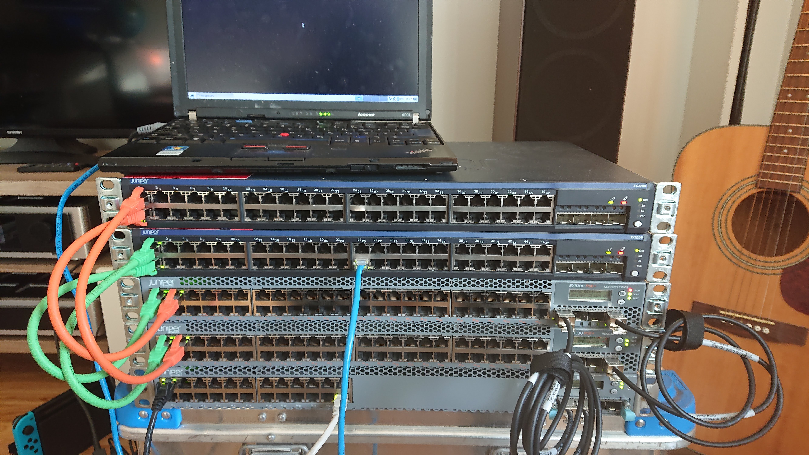
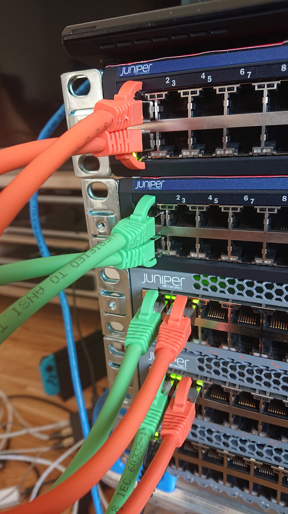
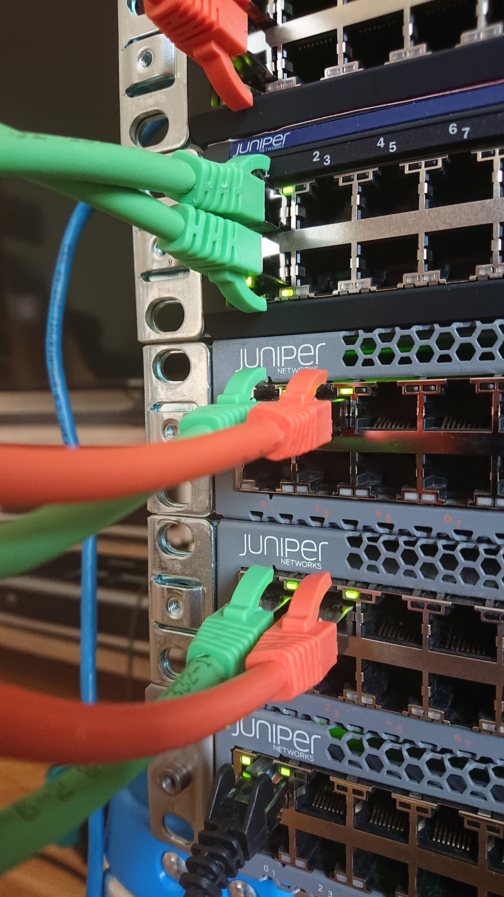
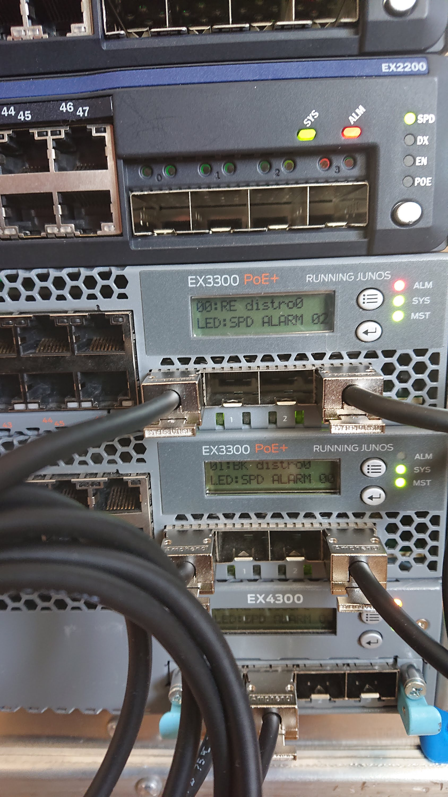

Tech:Online 2020
================

.. contents::

Intro
-----

.. warning::

   This is a WORK IN PROGRESS and is currently the first iteration of a
   _pilot_. It WILL change.

The Gathering 2020 had to go truly digital due to a virus outbreak not even
our firewalls could stop.

We had been looking forward to being part of the Tech crew at The
Gathering, and when "The Gathering: Online" was announced, an idea formed:
Let's do "Tech:Online" as well!

We have hundreds of switches, let's see what we can do with them. But more
than that, we want to let others in on the fun.

So welcome to the very first Tech:Online, where you get to configure an
actual TG distribution switch and edge switch. From scratch.

The task is simple: We've set up two edge switches and a distribution
switch for each participant in the event, but we've left out the
configuration. Instead, you get to log in to a raspbery pi with a bunch of
serial adapters and you get to configure the actual hardware yourself.

Normally we would have had a few thousand participants on a slightly larger
variant of this topology, but instead we have a laptop emulating a
participant.

This document outlines all you need to know (hopefully), and we also invite
you to hang out at discord to get or give tips. And feedback. We can change
this!

Suggested progress
------------------

You can work the issue however you desire, but for your own benefit, we
recommend using verify.sh, and following roughly this order of progress:

0. Skim through this entire document! There is a ton of useful information!
1. Find the distro switch
2. Set up LACP on distro0, ae0, towards core. Set up ae0.0 with the
   link-net IP below. Use 'show interface ae0 extensive' to see status. Use
   verify.sh (or check web(FIXME)).
3. Set up OSPF on distro0 towards core - it isn't nearly as difficult as it
   sounds, and it will ease everything else.
4. Set up lo0.0 on distro0 with the appropriate management IP - verify.sh
   should not get a reply from it.
5. Take a break.
6. Find edge0
7. Consider deleting the entire 'interface' section to unclutter it.
8. Set up ae0 on edge0 to point to ae100 on distro0 - focus on LACP first,
   but you need to assign an IP to unit 0. This is the same as step 2, but
   now you need to do both sides.
9. Set up ospf on edge0
10. Set up management interface on edge0
11. Check your progress with verify.sh - take a break!
12. Set up client ports on edge0
13. The default vlan is fine, but you need to assign an IP address to
    vlan.0 - the gateway IP.
14. Verify that it works!
15. If it works, use ``configure show | display set`` to easily copy the
    relevant bits to edge1, but remember to change IP addresses!

Hardware
--------

Two edge switches, EX2200.

Two distro-switches, EX3300, already configured for virtual-chassis.

The bottom-most EX4300 is the core, and excluded from the event.

From the distro::

   kly@distro0> show lldp neighbors 
   Local Interface  Parent Interface  Chassis Id          Port info   System Name
   ge-1/0/0.0       ae100.0           44:f4:77:68:d9:c0   uplink      edge0
   ge-0/0/0.0       ae100.0           44:f4:77:68:d9:c0   uplink      edge0
   ge-1/0/2.0       ae101.0           44:f4:77:69:2b:80   uplink      edge1
   ge-0/0/2.0       ae101.0           44:f4:77:69:2b:80   uplink      edge1
   xe-1/1/0.0       ae0.0             44:f4:77:ff:9d:00   xe-0/2/0    klycore
   xe-0/1/0.0       ae0.0             44:f4:77:ff:9d:00   xe-0/2/1    klycore

Note that edge1 is plugged into ``ge-x/0/2``, and ``ge-x/0/1`` is free.
This is purely for practical reasons.

In the distro, FPC0 is the first virtual-chassis member (the first EX3300),
and FPC1 is the second. It is fairly irrelevant which is which, since they
are set up identically. This means any port starting with ``ge-0/x/x``,
``xe-0/x/x`` or similar is on the first EX3300 switch, while ``ge-1/x/x``
and ``xe-1/x/x`` is on the second one.

On the edge, ``ge-0/0/0`` and ``ge-0/0/1`` is used for uplinks. At The
Gathering we tend to use ``ge-0/0/44`` to ``ge-0/0/47`` - but this was
flipped for Tech:Online - again, for purely practical reasons.

A laptop is attached to edge0, exactly which port is irrelevant and might
change - all ports not dedicated to uplink is expected to work.

Console
-------

Console access is achieved by ssh'ing to the jumphost (access provided
separately). Please do not miss-use this trust.

Please ask before installing things or chaning the system on the jumphost.
You do have sudo-access for the moment, but please behave.

You are connecting to a raspberry pi, which has 4 USB-to-serial adapters
attached and is hooked up to each of the involved switches directly. This
means that it is very difficult to lock yourself out of the lab.

To use the console, log in with ssh and issue ``screen /dev/ttyUSBx``,
where, x is 0, 1, 2, 3. Since the order in which the pi loads the USB
drivers seem to vary, it is not possible to tell ahead of time which ttyUSB
is which switch, since it might change at boot. Sorry.

Pre-configured
--------------

For convenience, the following is set up:

1. The distro-switch is already in a virtual-chassis. It is NOT set to
   avoid split-brain. You may want to do that.
2. Each switch has a "tech" user set up. It currently has super-user class.
   See the "credentials" section for credentials.
3. Each switch has a host-name set.
4. Each switch has ntp set up - but you wont notice that unless you get it
   running.
5. No other configuration is present.

You are free to use 'request system zeroize' if you like. The base
configuration is present on the jump-host ready to be used if you do.

Core
----

The core - which the distro0 is connected to - is a EX4300 and is outside
the scope of this exercise. For your convenience it provides a link-net
(see below for IPs) and ospf, area 0.0.0.0, and a default route is
exported. It should be trivial to utilize.

It is set up with 802.3ad / lacp for the uplinks.

Pictures
--------

Credentials
-----------

SSH to the provided IP using the provided username and password (FIXME).

Switches are set up with a user called "tech", password "Juniperftw!". You
are welcome to set up other users.

::

   user: tech
   pass: Juniperftw!

Commands:

- ``screen /dev/ttyUSB0`` - attach to console 0 (use USB1, USB2, USB3 for
  the other devices).
- When in screen, exit with ctrl a+\
- You can also detach with ctrl a+d, but then you need to re-attach with
  "screen -r" to open the same console again.

IP-plan
-------

This IP-plan is semi-fixed: The outer boundaries are set (uplink to core
and "down-link" to participant-laptop) and the exercise is designed with
this in mind.

All IP's are in the 10.1.0.0/16 range. This is to accommodate multiple
stations in parallel in the future.

Management is at 10.1.99.0/24, routed normally. You are welcome to use an
other approach or ignore management address entirely. It is up to you.

Linknets are /30 wide (net, peer 1, peer 2, broadcast), and are in the
10.1.200.0/24 prefix. The more central peer should have the lower number.
But you're welcome to do what you please with this. It's of little
consequence.

There are two client networks defined. For edge0, it is 10.1.100.0/24, for
edge1 it is 10.1.101.0/24. Terminating the client vlans at the edge is
recommended for simplicity, but you are also welcome to terminate them at
the distribution switch.

Table
-----

(ok, not technically a table)

::

	Top-range: 10.1.0.0/16

	Management: 10.1.99.0/24
	Linknet: 10.1.200.0/24
	edge0 clients: 10.1.100.0/24
	edge1 clients: 10.1.101.0/24

	Management:
	core - 10.1.99.1
	distro - 10.1.99.10
	e0 - 10.1.99.100
	e1 - 10.1.99.101

	linknet

	Core-link: 10.1.200.0/30
		   10.1.200.1 - core
		   10.1.200.2 - distro - ae0.0

	edge0-d:   10.1.200.4/30
		   10.1.200.5 - distro - ae100.0
		   10.1.200.6 - edge0 - ae0.0

	edge1-d:   10.1.200.8/30
		   10.1.200.9 - distro - ae101.0
		   10.1.200.10 - edge1 - ae0.0

Tips and tricks
---------------

Cli basics
..........

- Use ? to play with auto-complete
- Check cable-setup with ``show lldp neighbours``
- Check interfaces with ``show interfaces``
- Or ``show interfaces terse``
- Or ``show itnerfaces terse | match ae``
- Or ``show interfaces ae0 extensive``
- Check hardware with ``show chassis hardware``
- Configure things by entering "config" mode with ``configure``

Configuration basics
....................

- Once in configure-mode, you probably want to use ``set`` and ``delete``.
- To apply the configuration, use ``commit``, or ``commit confirmed``,
  which gives you a 10 minute window to verify that things work. If you do
  not issue an other ``commit``, the change will be rolled backed after 10
  minutes.
- Check changes with ``show | compare``
- Working in mostly one section? Use ``edit interfaces`` to avoid having to
  prefix everything with 'interfaces'.
- When done, use ``exit`` to go back to the regular cli.
- You can also roll back configuration changes with the "rollback" command.

Virtual chassis
...............

Virtual chassis is a Juniper technology for clustering multiple
identical(-ish) switches together into a single logical group. This is done
by inter-connecting otherwise autonomous switches and telling each of this.
One single switch will take the role as "master".

You do not have to think too much about this, as this is already taken care
of and will work even if you reset both switches in the distro (which is
usually a headache, but that's an other story).

Each individual switch in a virtual chassis is referred to as a "member".
There are three roles for members: a single master and a single backup and
one or more "line card".

One thing you may want to do is set ``set virtual-chassis
no-split-detection`` in case of a "power outage" on one "member".  Feel
free to google what that means.

Junos basics
............

- Interfaces are named 'ge-' for gigabit ethernet, 'xe-' for 10g-ethernet.
- Interface names are ``tech-FPC/PIC/PORT``, which comes out as
  ``ge-0/0/5``. FPC is normally a line card, but in our lab, it also refers
  to each member of a virtual chassis. So ``ge-0/0/5`` and ``ge-1/0/5`` is
  the same port on two different EX3300 in the same "virtual chassis".
- ``show`` commands are harmless
- ``request`` commands might trigger changes on the system
- Use ``ping`` and ``traceroute`` to check your progress.
- ``show route`` and ``show ospf route`` is neat.

Gotcha: aggregate count
.......................

Let me save you time::

   kly@distro0# show chassis
   aggregated-devices {
       ethernet {
           device-count 3;
       }
   }

Without this, no ae-interfaces will be created. With this, 3 will be made.
You can name them whatever, but this count needs to match or exceed the
number of ae-interfaces you define. It's silly, but there you are.

Linknets
........

A link-net is a network with two peers, typically two routers (in our
setup, each switch acts as a router).

To set up a link net you first need to establish the layer-2 connection.
Since every uplink is prepared with redundancy - two cables - you need to
configure an aggregate. Do this by configuring the physical interface with
``ether-options 802.3ad ae0``, where ae0 is a name you provide. You can
also use "interface-range" to avoid having to do it for each physical
interface individually.

Example::

       interface-range core {
           member xe-0/1/0;
           member xe-1/1/0;
           description core;
           ether-options {
               802.3ad ae0;
           }
       }

You also need to specify the actual aggregate interface, in this case, ae0.
For layer two, that means::

    ae0 {
        description core;
        aggregated-ether-options {
            lacp {
                active;
            }
        }
    }

If you commit this on both ends, you should be able to see the interface
coming alive with ``show interface ae0 extensive``. The names are local, so
edge0:ae0 can be connected to distro0:ae100.

Once this is up, you still need to set up an IP link - layer 3. For
distro0 to core, that means::

   ae0 {
       description core;
       aggregated-ether-options {
           lacp {
               active;
           }
       }
       unit 0 {
           family inet {
               address 10.1.200.2/30;
           }
       }
   }

Routing
.......

You can do routing the hard way or the easy way.

The hard way is to set up static routing between each switch. For this
setup, doing static routing isn't a big deal, but it wont get you on-line
since "core" is expecting ospf.

To set up ospf, you need a minimal config of::

   protocols {
      ospf {
          reference-bandwidth 500g;
          area 0.0.0.0 {
              interface ae0.0;
              interface lo0.0;
              interface ae100.0;
              interface ae101.0;
          }
      }
   }

(your interfaces may vary).

A better approach that will work on the edge switches too is to include a
policy. Since this is commonly cargo-culted, here's the gist::

   policy-options {
       policy-statement direct-to-ospf {
           from protocol direct;
           then {
               external {
                   type 1;
               }
               accept;
           }
       }
       policy-statement static-to-ospf {
           from protocol static;
           then {
               external {
                   type 1;
               }
               accept;
           }
       }
   }

And then the ospf bit becomes::

       ospf {
           export [ static-to-ospf direct-to-ospf ];
           reference-bandwidth 500g;
           area 0.0.0.0 {
               interface ae0.0;
               interface lo0.0;
               interface ae100.0;
               interface ae101.0;
           }
       }

(I suppose you don't need to add lo0.0 then either)

Loopback
........

A special interface, lo0, can be used as loopback. It is a good idea to
have a management interface on a switch, either on lo0 or some other
vlan/interface, which isn't associated with a linknet or similar.

For this exercise, I suggest using lo0.0 as management interface and
getting it routed.

