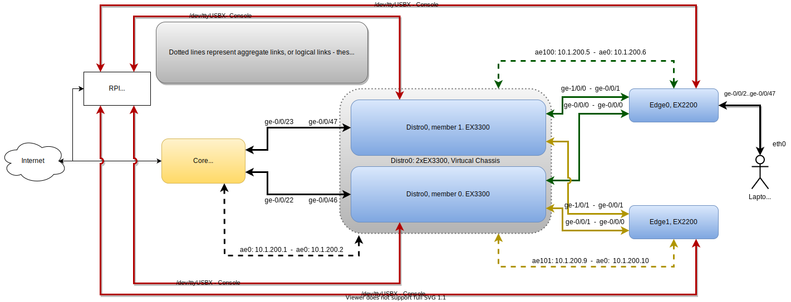
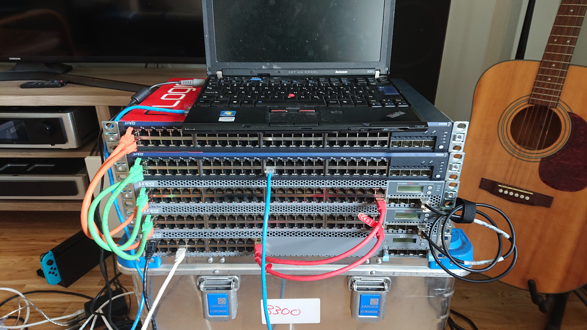
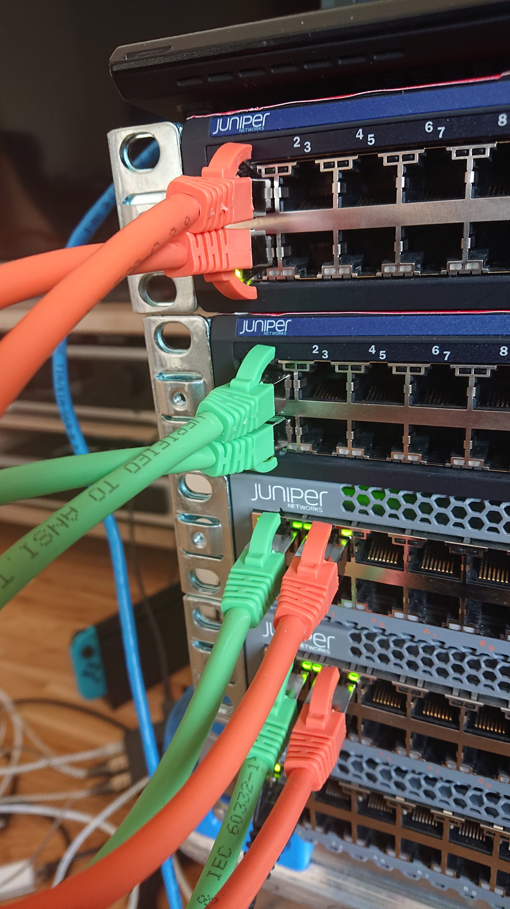
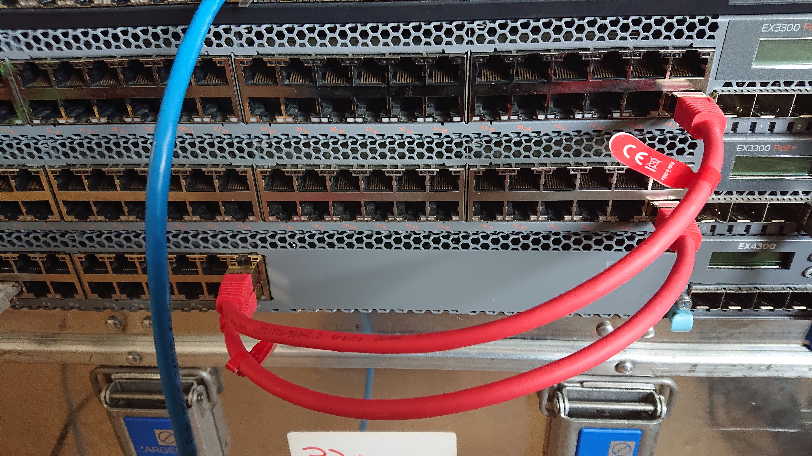
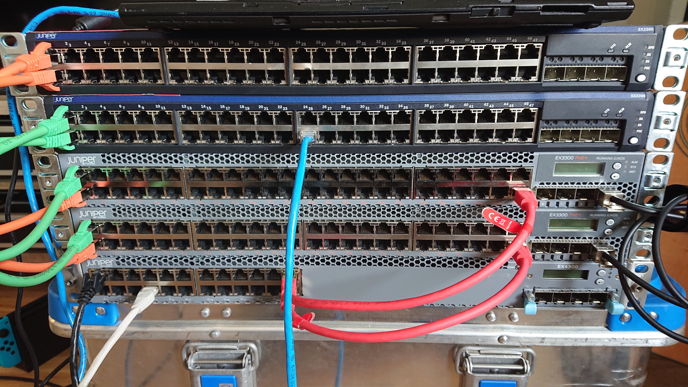

.. contents::

.. sectnum::

Intro
=====

.. warning::

   This is a WORK IN PROGRESS and is currently the first iteration of a
   _pilot_. It WILL change.

The task at hand
----------------

Our job is simple: We want to get FOO online. FOO is connected to a switch,
the switch is connected to a distribution switch and the distribution
switch is connected to the internet.

But to support thousands of users, we need to do network segmentation. Your
job is to configure the Juniper-switches to get FOO online. There are
varying degrees of guidance throughout the event.

The rest of this document is split in three:

1. A suggested progression which should allow you to get things gradually
   up and running and see actual progress. You do not have to follow this,
   but it is strongly recommended.
2. Facts about both the hardware configuration and expected IP plan. You
   need this. Parts of the IP plan is mandatory, the rest is strongly
   recommended.
3. Intro to junos, networking and general tips and tricks which are highly
   relevant.

You should also watch the verification tool, which provide generous hints
to get you going and will refer you back to this document.

If in doubt: Ask for help or hints on Discord!

End result
----------

This is exactly what is being checked for:

1. The FOO pc at 10.x.100.2 needs to successfully get ping replies from the
   internet. You should also be able to ping it from your jumphost.
2. LACP needs to be configured between the distro and core and between
   distro and each edge switch.
3. Likewise: linknets need to work.
4. The systems should reply to ssh (they do already if brought on-line).

Progress
========

Environment
-----------

You need an SSH client, if you are on windows "PuTTy" is recommended.

You will be provided an IP address, port and a username and password to SSH
to, this is where you will work.

Start by making sure that works. You may want to use multiple windows.

To connect to a switch, run the commands ``screen /dev/ttyUSB0`` for the
first switch, and ``screen /dev/ttyUSB1`` for the second, and so on for
``/dev/ttyUSB2`` and ``/dev/ttyUSB3``. You may have to hit "enter" to get
an actual prompt the first time.

Two of those ``/dev/ttyUSB`` devices will be the EX3300 distribution
switch - you can use either - see if you can figure out why there are
two...

Once screen is running, you can exit screen with ``ctrl+a d`` - that is,
hold CTRL while pressing ``a``, let go, then press d. This will "detach"
and you can "re-attach" with ``screen -r``.

The machine you have ssh'ed to is connected to the same network as your
switches, so when things are configured, you can reach FOO from that
machine. But you do not have to worry about locking yourself out: The
console access you have is "out of band" and does not require the switches
to work (beyond being able to see a login prompt).

Suggested progress
------------------

Typically there are three general strategies when setting up a network: 

1. Start at the client and work towards the internet/core
2. Start at the core and work towards the client
3. Random order

Because it makes it much easier to test, we recommend following option
number 2. Specifically:

Phase 1: First linknet
......................

0. Skim through this entire document! There is a ton of useful information!
1. Find the distro switch with screen
2. The distribution switch has two cables connected to the core (see the
   `Reference documentation`_ chapter) and you need to configure them as an
   aggregated interface.
3. Set up LACP on distro0, ae0, towards core (see `Tips and tricks`_). That
   means setting up an ``interfaces`` section for both physical devices -
   or a interfaces-range that cover both.
4. Set up "unit 0" on ae0 on the distro. It needs to have the link-net IP
   provided in the `Reference documentation`_ chapter.
5. Check that your uplink ports (`ge-0/0/46` and `ge-0/0/46`) are listed as
   "up" when you use ``show interfaces``.
6. If they are, check that ``ae0.0`` is up with ``show interfaces ae0.0
   extensive``.
7. If you've done everything right up until now, verify.sh should tell you
   that 10.x.200.2 replies to ping from core, but not globally.
8. Let your distro switch know that `10.x.200.1` is your default route. See
   `Reference documentation`_ on static routing to accomplish this.
9. At this point, you should be able to run ``ping 192.168.2.2`` from the
   distro0 switch and get a reply, and the verification script should state
   that `10.x.200.2` replies both from core and globally.

At this point you have a working distro0 switch! Be happy! Take a break.

Interesting things to try: Try ``ssh 10.x.200.2`` from the jumphost
directly. It should let you ssh directly to the switch.

Phase 2: Establish a link to edge0
..................................

Now that distro0 is up, we want to get a link to edge0. We start on
distro0.

1. Edge0 is connected through ports ``ge-0/0/0`` and ``ge-1/0/0`` on
   distro0. Just as with your core link, you need to configure LACP to bond
   these to interfaces together.
2. Create an ``interface`` section for ``ge-0/0/0`` and ``ge-1/0/0`` that
   enables 802.3ad. Call the ae-interface ``ae100`` for convenience.
3. Set up "unit 0" on ae100. You will find the appropriate link-net IP in
   the reference documentation.
4. Once this is up, using ``show interfaces ae100 extensive`` should show
   the link as DOWN, but it should also show the IP and the physical ports
   should be listed as up. It's time to connect to edge0.
5. Open a screen session to ``edge0`` - log in.
6. On edge0, it's the same deal, but different interfaces: ``ge-0/0/0`` and
   ``ge-0/0/1`` is connected to the distro.
7. Do the same as step 2 and 3: Set up an ``interface`` section for the
   physical interfaces (``ge-0/0/0`` and ``ge-0/0/1``). For this end, use
   ``ae0``.
8. Set up an ``interface`` section for ``ae0`` and ``ae0`` unit 0, with the
   other end of the link-net IP.
9. Check ``show interfaces ae0``. It _should_ display as UP, and with the
   correct IP and bandwidth 2Gbps.
10. Verify: run ``ping 10.x.200.5`` on edge0 and ``ping 10.x.200.6`` on
    distro0: it should reply.
11. The verify-script will still only get a global reply from 10.x.200.5 -
    the distro side of the link.
12. Back on edge0, set up a static route using 10.x.200.5 as default
    gateway.
13. Verify should now get a global reply from both 10.x.200.5 and
    10.x.200.6

If you've gotten this far, you've gotten basic connectivity done! Good
work! Take a break, brag a bit.

Things to test: Try disabling an up-link with ``set interfaces ge-0/0/0
disable`` (in configure), then check the speed of ae0 with ``show
interfaces ae0``. Re-enable the uplink-port with ``delete interfaces
ge-0/0/0 disable``.

Phase 3: Rinse and repeat for edge1
...................................

There are two edge-switches, so now you get to do phase 2 all over again.
Instead of repeating the instructions, here's a tip:

``show configuration interfaces | display set`` can be used to extract
set-statements, edit (in vim/notepad/whatever), and paste it back in. Just
remember to modify the IP addresses!

By the end of this phase, all three switches should be fully connected,
everything should verify correctly, except that the client FOO is still not
on-line.

Phase 4: Get a client on-line!
..............................

1. Connect to edge0, what you want to do is set all client ports to belong
   to "family ethernet-switching". This is probably best done with ``set
   interfaces interface-range clients member-range ge-0/0/2 to ge-0/0/47``,
   and then applying any other interface-statements to the ``clients``
   interface range. See `Reference documentation`_ for examples.
2. Once this is done, basic switching works, but there's no way for you to
   know and there's no way to test. You have created a LAN with no
   connection to the outside world.
3. Each such port is connected to a vlan, by default, this is the `default`
   vlan - you can look at it with ``show vlans default``.
4. Assign a "layer 3" interface to the default vlan, it should be named
   `vlan.0`.
5. Assign an IP address to the `vlan.0` interface.
6. Check if vlan.0 is up with ``show interface vlan.0``.
7. Ping 10.x.100.2 locally from edge0 - it should now reply (locally).
8. To get it working globally, you need to log in to distro0 and create a
   static route for 10.x.100.0/24 via 10.x.200.6 (the edge0 linknet IP).
9. Check that it works.
10. Do the same for edge1 :D

If you made it this far, the verify script should be very happy just about
now, and you should be happy as well!

Things to try: You may want to set up OSPF instead of all this static
routing. For our 3-switch example, it's not a big deal, but as you can
imagine, keeping track of which network belongs where can get bothersome.
Try deleting all the static routing, except the default route on distr0,
and setting up OSPF. It isn't nearly as tricky as it might sound.

Reference documentation
=======================

Topology
--------

Hardware
--------

Two edge switches, EX2200.

Two distro-switches, EX3300, already configured for virtual-chassis.

The bottom-most EX4300 is the core, and excluded from the event.

From the distro::

   kly@distro0> show lldp neighbors 
   Local Interface    Parent Interface  Chassis Id          Port info    System Name
   ge-1/0/0.0         ae100.0           44:f4:77:68:d9:c0   ge-0/0/0.0   edge0
   ge-0/0/0.0         ae100.0           44:f4:77:68:d9:c0   ge-0/0/1.0   edge0
   ge-1/0/1.0         ae101.0           44:f4:77:69:2b:80   ge-0/0/0.0   edge1
   ge-0/0/1.0         ae101.0           44:f4:77:69:2b:80   ge-0/0/1.0   edge1
   ge-0/0/47.0        ae0.0             44:f4:77:ff:9d:00   ge-0/0/22    klycore
   ge-1/0/47.0        ae0.0             44:f4:77:ff:9d:00   ge-0/0/23    klycore

In the distro, FPC0 is the first virtual-chassis member (the first EX3300),
and FPC1 is the second. It is fairly irrelevant which is which, since they
are set up identically. This means any port starting with ``ge-0/x/x``,
``xe-0/x/x`` or similar is on the first EX3300 switch, while ``ge-1/x/x``
and ``xe-1/x/x`` is on the second one.

On the edge, ``ge-0/0/0`` and ``ge-0/0/1`` is used for uplinks. At The
Gathering we tend to use ``ge-0/0/44`` to ``ge-0/0/47`` - but this was
flipped for Tech:Online - again, for purely practical reasons.

A laptop is attached to edge0, exactly which port is irrelevant and might
change - all ports not dedicated to uplink is expected to work.

Console
-------

Console access is achieved by ssh'ing to the jumphost (access provided
separately). Please do not miss-use this trust.

Please ask before installing things or chaning the system on the jumphost.
You do have sudo-access for the moment, but please behave.

You are connecting to a raspberry pi, which has 4 USB-to-serial adapters
attached and is hooked up to each of the involved switches directly. This
means that it is very difficult to lock yourself out of the lab.

To use the console, log in with ssh and issue ``screen /dev/ttyUSBx``,
where, x is 0, 1, 2, 3. Since the order in which the pi loads the USB
drivers seem to vary, it is not possible to tell ahead of time which ttyUSB
is which switch, since it might change at boot. Sorry.

Pre-configured
--------------

For convenience, the following is set up:

1. The distro-switch is already in a virtual-chassis. It is NOT set to
   avoid split-brain. You may want to do that.
2. Each switch has a "tech" user set up. It currently has super-user class.
   See the "credentials" section for credentials.
3. Each switch has a host-name set.
4. Each switch has ntp set up - but you wont notice that unless you get it
   running.
5. No other configuration is present.

You are free to use 'request system zeroize' if you like. The base
configuration is present on the jump-host ready to be used if you do.

Core
----

The core - which the distro0 is connected to - is a EX4300 and is outside
the scope of this exercise. For your convenience it provides a link-net
(see below for IPs) and ospf, area 0.0.0.0, and a default route is
exported. It should be trivial to utilize.

It is set up with 802.3ad / lacp for the uplinks.

Pictures
--------

Credentials
-----------

SSH to the provided IP using the provided username and password (FIXME).

Switches are set up with a user called "tech", password "Juniperftw!". You
are welcome to set up other users.

::

   user: tech
   pass: Juniperftw!

Commands:

- ``screen /dev/ttyUSB0`` - attach to console 0 (use USB1, USB2, USB3 for
  the other devices).
- When in screen, exit with ctrl a+\
- You can also detach with ctrl a+d, but then you need to re-attach with
  "screen -r" to open the same console again.

IP-plan
-------

This IP-plan is semi-fixed: The outer boundaries are set (uplink to core
and "down-link" to participant-laptop) and the exercise is designed with
this in mind.

All IP's are in the 10.1.0.0/16 range. This is to accommodate multiple
stations in parallel in the future.

Management is at 10.1.99.0/24, routed normally. You are welcome to use an
other approach or ignore management address entirely. It is up to you.

Linknets are /30 wide (net, peer 1, peer 2, broadcast), and are in the
10.1.200.0/24 prefix. The more central peer should have the lower number.
But you're welcome to do what you please with this. It's of little
consequence.

There are two client networks defined. For edge0, it is 10.1.100.0/24, for
edge1 it is 10.1.101.0/24. Terminating the client vlans at the edge is
recommended for simplicity, but you are also welcome to terminate them at
the distribution switch.

Table
-----

(ok, not technically a table)

::

	Top-range: 10.1.0.0/16

	Management: 10.1.99.0/24
	Linknet: 10.1.200.0/24
	edge0 clients: 10.1.100.0/24
	edge1 clients: 10.1.101.0/24

	Management:
	core - 10.1.99.1
	distro - 10.1.99.10
	e0 - 10.1.99.100
	e1 - 10.1.99.101

	linknet

	Core-link: 10.1.200.0/30
		   10.1.200.1 - core
		   10.1.200.2 - distro - ae0.0

	edge0-d:   10.1.200.4/30
		   10.1.200.5 - distro - ae100.0
		   10.1.200.6 - edge0 - ae0.0

	edge1-d:   10.1.200.8/30
		   10.1.200.9 - distro - ae101.0
		   10.1.200.10 - edge1 - ae0.0

Tips and tricks
===============

Basic Junos CLI
---------------

First: Junos is Juniper's OS.

Junos CLI is a command-line interface to configure and review Juniper
hardware. This isn't a complete guide, but a crash course.

First: Tab completion works, and '?' will give you extensive help. Learn to
love it. You also have "help reference (topic)".

You will be working mostly with the ``show`` command to review system
status, the ``ping`` command to ping locally, and ``configure`` to change
configuration.

The actual CLI for ``show`` is mostly self explanatory, but here are a few
hints::

   # Show all interfaces configured, with moderate amount of extra
   # information
   show interfaces 

   # Show a single interface, with extensive information
   show interfaces ae0 extensive

   # Show a one-line output per interface
   show interfaces terse

   # ... and look only for lines matching "ae"
   show interfaces terse | match ae

   # Show LLDP neighbors: LLDP is a protocol for discovering physically
   # connected devices - it isn't fool proof, but it's  a great help
   show lldp neighbours

   # Others:
   show chassis hardware
   show version
   show system uptime

Configuration can be reviewed with ``show configuration``, but to modify
it, run ``configure`` stand-alone, which will enter configuration mode.

When in configuration mode, you can review the current configuration stance
with ``show`` (by default: the entire configuration). You modify the
configuration by adding and deleting statements with ``set`` and
``delete``. The configuration changes do *not* take effect immediately, but
only after you issue ``commit``, which also does various checks first.

You can also issue ``rollback`` to roll back the configuration. Use
``rollback ?`` to see timestamps of versions you can roll back to.

You can see what changes you've made prior to a commit with ``show |
compare``.

You can also combine all ``show`` commands in configuration mode with
``display set``, which displays the configuration as ``set``/``delete``
commands, which is also suitable for copy/paste.

Cheat sheet for configuration mode::

   # Set options on a single interface
   set interfaces ge-0/0/46 ether-options 802.3ad ae0

   # Create an interface-range to avoid having a gazillion set-statements
   set interfaces interface-range clients member-range ge-0/0/2 to ge-0/0/47
   set interfaces interface-range clients description clients
   set interfaces interface-range clients unit 0 family ethernet-switching

   # You don't have to specify all set-commands to delete something under a
   # "tree", so:
   delete interfaces interface-range clients member-range ge-0/0/2 to ge-0/0/47
   delete interfaces interface-range clients description clients
   delete interfaces interface-range clients unit 0 family ethernet-switching

   # might be better written as
   delete interfaces interface-range clients

   # Commit changes
   show | compare
   show | compare | display set
   commit

   # You can use "edit" to focus on a single section, so this:
   set interfaces ae0 unit 0 family inet 10.1.200.2/30

   # is the same as:
   edit interfaces ae0
   set family inet 10.1.200.2/30

   # To get to the top again, use "top".
   top

   # Exit config mode - if you used "edit", it will exit that section
   exit

Aggregated interfaces
---------------------

This is were terminology is annoying, because there are about fifty
different words that describe roughly the same thing. "Bonding", "trunk",
"link aggregate groups", "aggregated interfaces"... All refer to more or
less the same thing.

The essence is: You have more than one physical link/cable going from A to
B, and you want to bundle them together and treat them as one logical
interface.

For us, this serves two purposes:

1. If someone accidentally unplugs a cable, the switch will still be
   on-line (this happens ALL THE TIME at The Gathering, specially on day 1)
2. Increased bandwidth.

On Juniper, aggregated interfaces are named "aeX", where X is an arbitrary
number you assign to it. For convenience, we use ae0 to refer to "uplink to
a bigger device".

To set up an aggregated interface, you need to first configure the
_physical_ device to be part of the aggregate, then configure the
aggregated device itself.

The first step is fairly simple::

   delete interfaces ge-0/0/0
   delete interfaces ge-0/0/1
   set interfaces ge-0/0/0 ether-options 802.3ad ae0
   set interfaces ge-0/0/1 ether-options 802.3ad ae0

It might be nicer to write::

   delete interfaces ge-0/0/0
   delete interfaces ge-0/0/1
   set interfaces interface-range uplink description uplink
   set interfaces interface-range uplink member ge-0/0/0
   set interfaces interface-range uplink member ge-0/0/1
   set interfaces interface-range uplink ether-options 802.3ad ae0

Generally speaking, interface-ranges are very nice (though for two ports,
it's not much of a difference).

Next, you need to actually enable LACP on the device and configure a family
to bring the interface up::

   set interfaces ae0 description uplink
   set interfaces ae0 aggregated-ether-options lacp active
   set interfaces ae0 unit 0 family inet address 10.1.200.2/30

To review this, commit it, exit config mode and see ``show interfaces ae0
extensive``.

LACP?
.....

LACP is the Link Aggregation Control Protocol. It is used explicitly to
connect devices with multiple ports, but most importantly, it is the
protocol that figures out exactly how many of the available links are
actually working and how to deal with link failures. For our purposes, it's
not very exotic, but for more complex setups you can use LACP to say that
if less than 3 of these 5 links are up, then take the entire link down (so
the router can move the traffic to alternate routes).

Linknets - theory and practice
------------------------------

A link-net is a tiny IP network that works as an interconnect between two
routers. A linknet has two IP addresses assigned to it, one belonging to
each of the interconnected devices. A router can have multiple linknets if
it is connected to multiple other routers.

In our example, there are exactly three linknets:

1. A linknet between distro0 and core - you only have to configure one side
   of it.
2. A linknet between distro0 and edge0
3. A linknet between distro0 and edge1

Since it only requires two IP addresses, the netmask is 255.255.255.252, or
more commonly /30 - one IP for either end, plus an IP for the network and
broadcast (it is also common to use /31, but this is somewhat iffy).

Setting up a link-net is a two-step process. First you need to configure
the physical link. All the linknets we are using are established on top of
multiple physical links - multiple cables. So you first need to establish
an aggregate interface (see the previous chapter).

Once the physical link is up, you need to set up an IP address on it. For
juniper, this is fairly easy. Let's assume we are working on the distro0 -
edge1 connection. On distro0, you run (assuming ae101 has LACP up)::

   set interfaces ae101 description edge0
   set interfaces ae101 unit 0 family inet address 10.1.200.9/30
   commit

On the edge1 side, you match it up::

   set interfaces ae0 description distro
   set interfaces ae0 unit 0 family inet address 10.1.200.10/30
   commit

After this, both sides should be able to ping 10.1.200.10 and 10.1.200.9.

And that's really all there is to it.

Leftovers
---------

Virtual chassis
...............

Virtual chassis is a Juniper technology for clustering multiple
identical(-ish) switches together into a single logical group. This is done
by inter-connecting otherwise autonomous switches and telling each of this.
One single switch will take the role as "master".

You do not have to think too much about this, as this is already taken care
of and will work even if you reset both switches in the distro (which is
usually a headache, but that's an other story).

Each individual switch in a virtual chassis is referred to as a "member".
There are three roles for members: a single master and a single backup and
one or more "line card".

One thing you may want to do is set ``set virtual-chassis
no-split-detection`` in case of a "power outage" on one "member".  Feel
free to google what that means.

Routing
.......

You can do routing the hard way or the easy way.

The hard way is to set up static routing between each switch. For this
setup, doing static routing isn't a big deal, but it wont get you on-line
since "core" is expecting ospf.

To set up ospf, you need a minimal config of::

   protocols {
      ospf {
          reference-bandwidth 500g;
          area 0.0.0.0 {
              interface ae0.0;
              interface lo0.0;
              interface ae100.0;
              interface ae101.0;
          }
      }
   }

(your interfaces may vary).

A better approach that will work on the edge switches too is to include a
policy. Since this is commonly cargo-culted, here's the gist::

   policy-options {
       policy-statement direct-to-ospf {
           from protocol direct;
           then {
               external {
                   type 1;
               }
               accept;
           }
       }
       policy-statement static-to-ospf {
           from protocol static;
           then {
               external {
                   type 1;
               }
               accept;
           }
       }
   }

And then the ospf bit becomes::

       ospf {
           export [ static-to-ospf direct-to-ospf ];
           reference-bandwidth 500g;
           area 0.0.0.0 {
               interface ae0.0;
               interface lo0.0;
               interface ae100.0;
               interface ae101.0;
           }
       }

(I suppose you don't need to add lo0.0 then either)

Loopback
........

A special interface, lo0, can be used as loopback. It is a good idea to
have a management interface on a switch, either on lo0 or some other
vlan/interface, which isn't associated with a linknet or similar.

For this exercise, I suggest using lo0.0 as management interface and
getting it routed.

